# 🚗 AutoGestion

Application web full-stack de gestion de parc automobile, développée avec **Angular** et **Spring Boot**, conteneurisée avec **Docker**.

## 🛠️ Technologies

| Couche | Technologie |
|--------|------------|
| Frontend | Angular 14, TypeScript, Bootstrap 5 |
| Backend | Spring Boot 2.6, Java 8, Spring Security (JWT) |
| Base de données | MySQL 8.0 |
| Conteneurisation | Docker, Docker Compose |

## 📋 Fonctionnalités

- **Authentification** : Connexion / Inscription sécurisées avec JWT
- **Gestion des voitures** : CRUD complet avec upload d'images
- **Gestion des modèles** : Créer, modifier, supprimer des modèles de voitures
- **Gestion des utilisateurs** : CRUD avec attribution de rôles et photos de profil (Admin)
- **Gestion des rôles** : Créer, modifier, supprimer des rôles (Admin)
- **Recherche** : Recherche de voitures par nom
- **Drag & Drop** : Réorganisation des voitures par glisser-déposer
- **Dashboard** : Tableau de bord avec statistiques

## 🚀 Comment lancer le projet

### Prérequis
- [Docker Desktop](https://www.docker.com/products/docker-desktop/) installé et lancé

### Lancement

```bash
# 1. Cloner le projet
git clone https://github.com/lahmarWissem/AutoGestion.git
cd AutoGestion

# 2. Lancer tous les services (MySQL + Backend + Frontend)
docker-compose up -d --build
```

### Accès

| Service | URL |
|---------|-----|
| 🌐 Frontend | [http://localhost:4200](http://localhost:4200) |
| ⚙️ Backend API | [http://localhost:8081](http://localhost:8081) |
| 🗄️ MySQL | `localhost:3306` |

### Comptes par défaut

| Utilisateur | Mot de passe | Rôle |
|-------------|-------------|------|
| `admin` | `admin123` | ADMIN |
| `amina` | `amina123` | USER |

### Arrêter les services

```bash
docker-compose down
```

### Réinitialiser la base de données

```bash
docker-compose down -v    # Supprime les volumes (données MySQL)
docker-compose up -d --build
```

## 📁 Structure du projet

```
AutoGestion/
├── miniProjetAngular/        # Frontend Angular
│   └── src/app/
│       ├── admin-dashboard/  # Tableau de bord
│       ├── list-voitures/    # Liste des voitures
│       ├── add-voitures/     # Ajouter une voiture
│       ├── update-voiture/   # Modifier une voiture
│       ├── liste-users/      # Liste des utilisateurs
│       ├── add-user/         # Ajouter un utilisateur
│       ├── update-user/      # Modifier un utilisateur
│       ├── list-roles/       # Liste des rôles
│       ├── add-role/         # Ajouter un rôle
│       ├── update-role/      # Modifier un rôle
│       ├── list-modeles/     # Gestion des modèles
│       ├── recherche-par-nom/# Recherche
│       ├── login/            # Page de connexion
│       ├── register/         # Page d'inscription
│       └── services/         # Services Angular (API)
├── SpringProjectVoiture/     # Backend Spring Boot
│   └── src/main/java/com/amina/voiture/
│       ├── entities/         # Entités JPA
│       ├── repos/            # Repositories
│       ├── rest/             # Contrôleurs REST
│       ├── services/         # Interfaces de services
│       ├── serviceImpl/      # Implémentations
│       └── Security/         # Configuration JWT
├── docker-compose.yml        # Orchestration Docker
├── init-db.sql               # Script d'initialisation DB
└── screenshots/              # Captures d'écran
```

## 📸 Captures d'écran

### Connexion
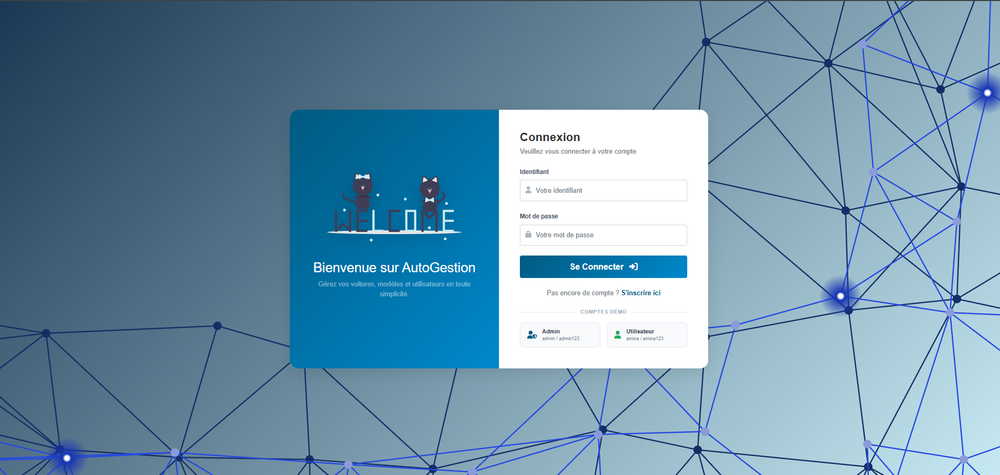

### Inscription
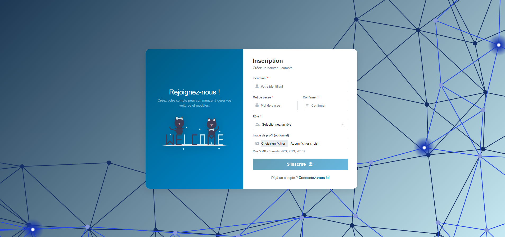

### Tableau de bord
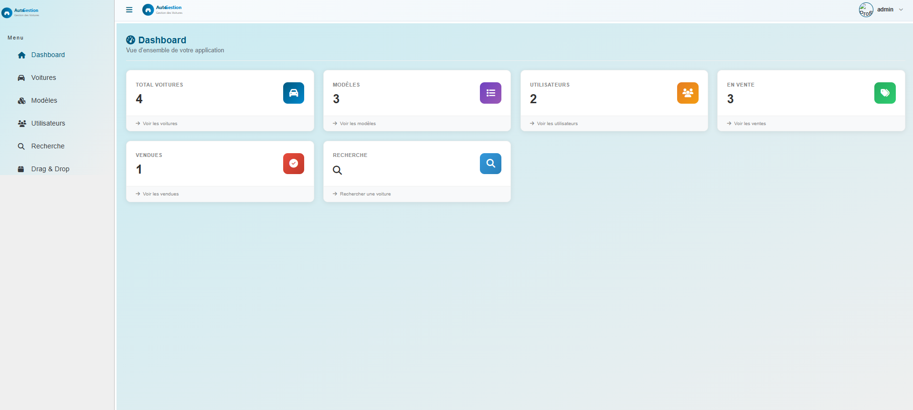

### Liste des voitures
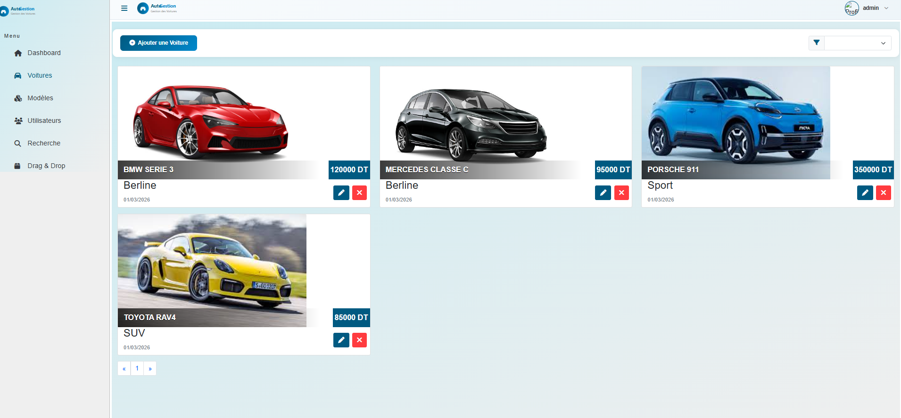

### Ajouter une voiture
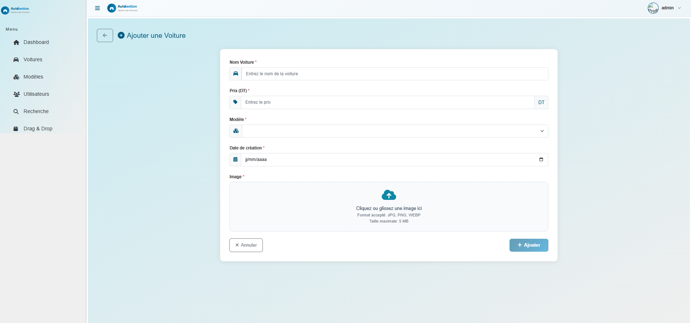

### Modifier une voiture
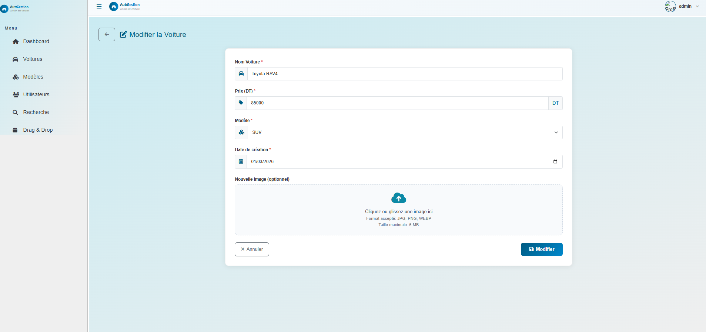

### Recherche de voitures
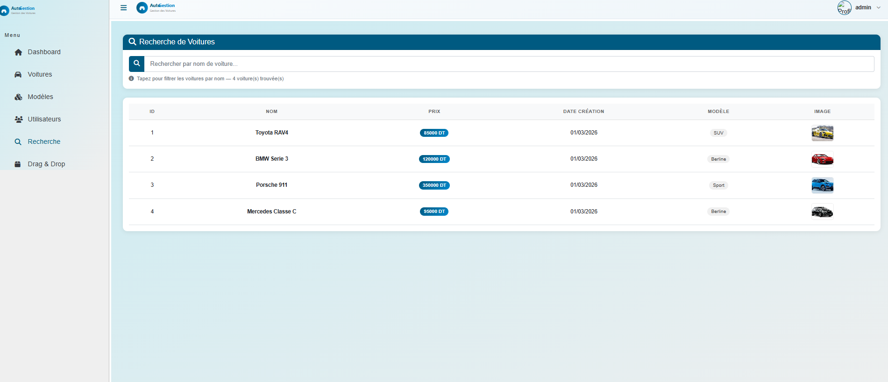

### Liste des utilisateurs
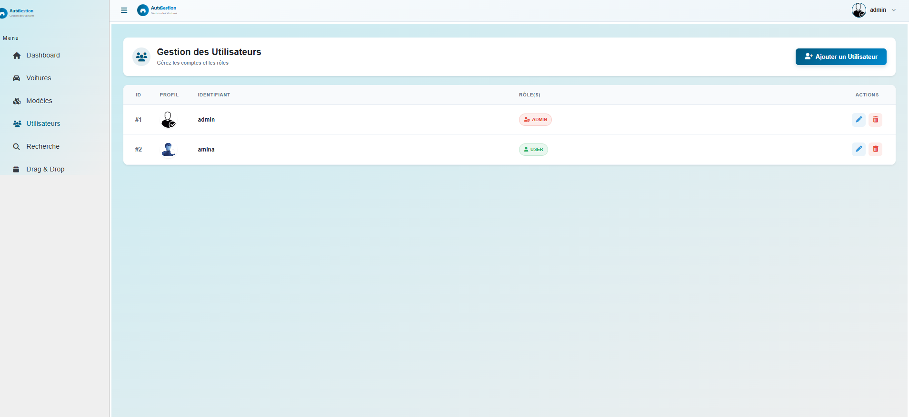

### Ajouter un utilisateur
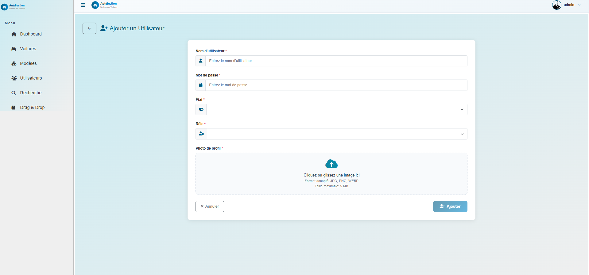

### Modifier un utilisateur
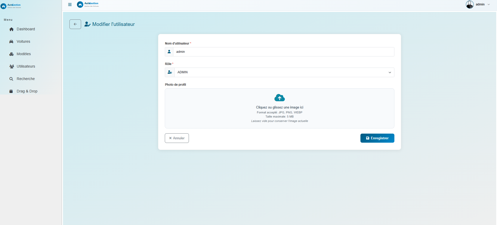

### Gestion des modèles
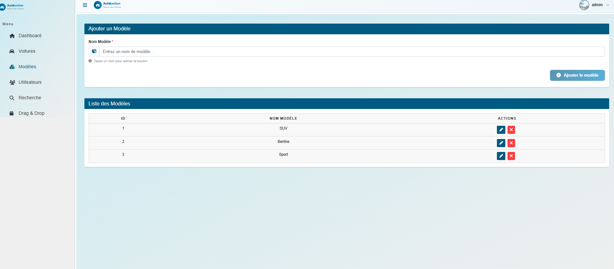

### Drag & Drop
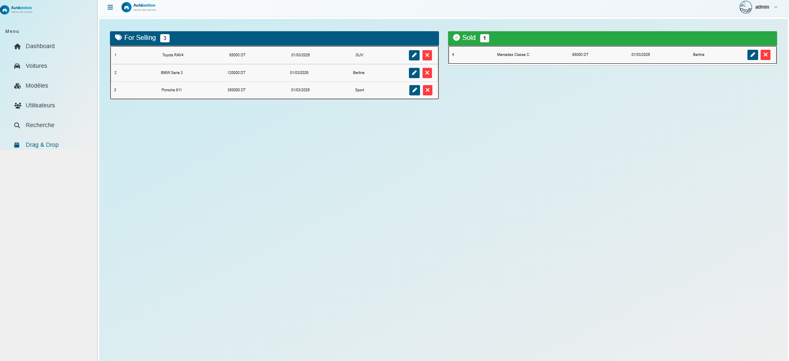

### Diagramme de classes
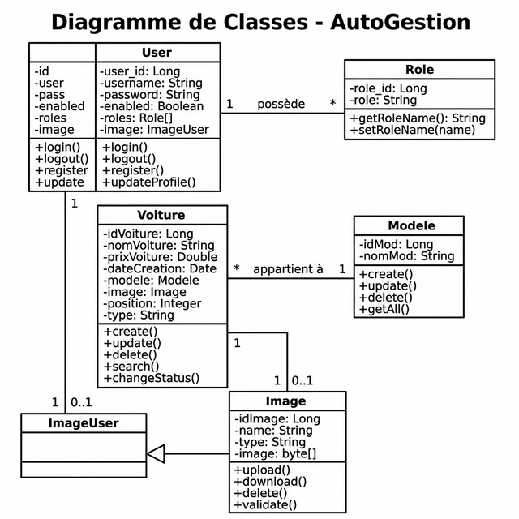

### Diagramme de cas d'utilisation
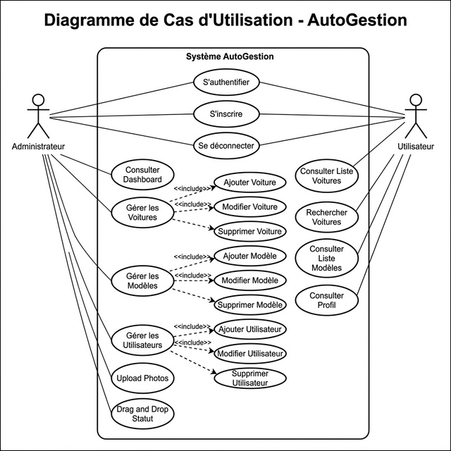
